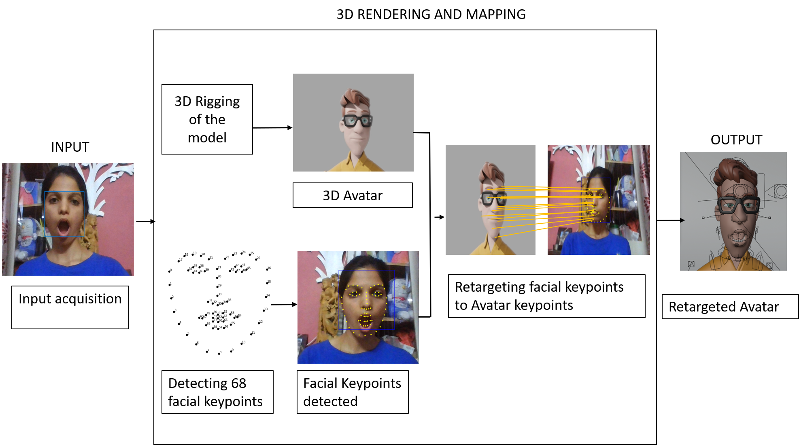

# 🎭 Metaverse Avatar Emotion Mapper

A real-time facial retargeting system that captures human facial expressions via webcam and maps them instantly to a 3D avatar in Blender. Designed to enhance immersion for Metaverse applications, online interactions, and VR gaming.

*(The architecture utilizes a webcam feed to extract 68 facial landmarks and retargets them to a rigged 3D model)*



## 🚀 Features

* **Real-Time Retargeting:** Low-latency mapping of user expressions to digital avatars using OpenCV and Blender's modal operators.
* **68-Point Landmark Detection:** High-fidelity tracking of eyes, mouth, jaw, and eyebrows utilizing the Dlib shape predictor.
* **Dynamic Expression Support:** Capable of rendering complex states like "Mouth Wide Open," "Eyes Closed," and "Head Tilt" by manipulating specific bone controls (e.g., `mouth_ctrl`, `head_fk`).
* **Blender Integration:** Seamless pipeline using rigged 3D models for high-quality rendering directly within the Blender Viewport.

## 🛠️ Tech Stack

* **Core:** Python, OpenCV (`cv2`)
* **3D Engine:** Blender API (`bpy`)
* **Computer Vision:** Dlib / MediaPipe (68 Facial Landmarks)
* **Hardware:** Standard Webcam (approx. 60cm distance recommended)

## 📋 Prerequisites

* **Blender:** Version 2.8
* **Python:** Python 3 (bundled with Blender).
* **Hardware:** Standard Webcam.
* **Model:** `shape_predictor_68_face_landmarks.dat` (Dlib model).

## 📦 Installation

### 1. Install Dependencies
You must install the required libraries into **Blender's bundled Python environment** (not your system Python).

1.  Locate the python executable inside your Blender installation path:
    * *Windows:* `.../Blender 2.8x/python/bin/python.exe`
    * *Mac/Linux:* `.../Blender 2.8x/python/bin/python3.7m`
2.  Run these commands in your terminal using that path:

```bash
# Upgrade pip
path/to/blender-python -m pip install --upgrade pip --user

# Install required libraries
path/to/blender-python -m pip install opencv-python opencv-contrib-python imutils numpy dlib --user
```
> **Note:** Replace `path/to/blender-python` with the actual path found in Step 1.
> *Example:* `C:\Program Files\Blender Foundation\Blender 2.83\2.83\python\bin\python.exe`

### 2. Download the Face Predictor Model
The script requires the Dlib 68-point face landmark predictor.

1.  Download **`shape_predictor_68_face_landmarks.dat`** from [dlib-models](https://github.com/davisking/dlib-models) or [dlib.net](http://dlib.net/files/shape_predictor_68_face_landmarks.dat.bz2).
2.  Extract the `.bz2` archive to get the `.dat` file.
3.  Save the file to a known location on your computer.

### 3. Configure the Script
1.  Open `OpenCVAnimOperator.py` in a text editor or inside Blender's Scripting tab.
2.  Navigate to **Line 14**, where the path variable `p` is defined.
3.  Update the path to match the location where you saved the `.dat` file.

```python
# Example for Windows
p = "C:\\Users\\YourName\\Documents\\shape_predictor_68_face_landmarks.dat"

# Example for Mac/Linux
p = "/home/yourname/shape_predictor_68_face_landmarks.dat"
```

### 4. Setup in Blender
1.  Open your Blender project (using the "Vincent" rig or your custom rig).
2.  Switch to the **Scripting** tab at the top of the window.
3.  Load both `OpenCVAnimOperator.py` and `OpenCVAnim.py` into the text editor area.
4.  Run **both scripts** by clicking the **Run Script** play button (icon ▶) for each file.
5.  **Important:** Ensure your rig's collection name in the Outliner matches the `rig_name` variable in `OpenCVAnimOperator.py` (Line 18).
